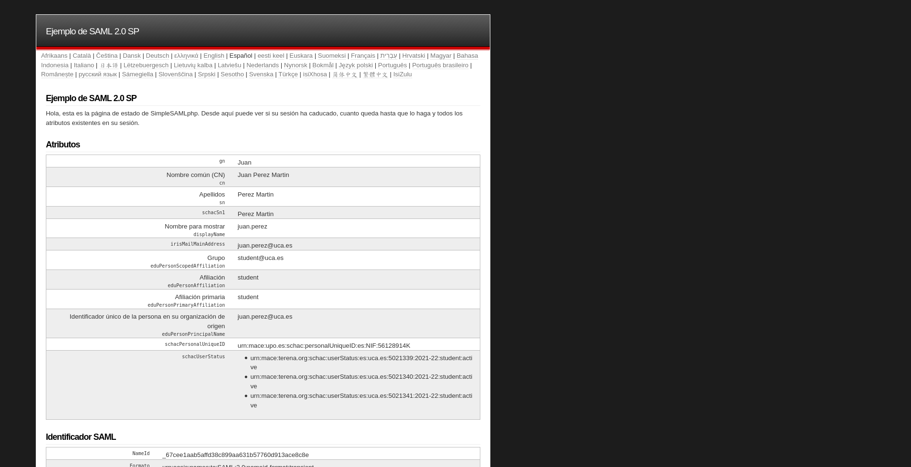
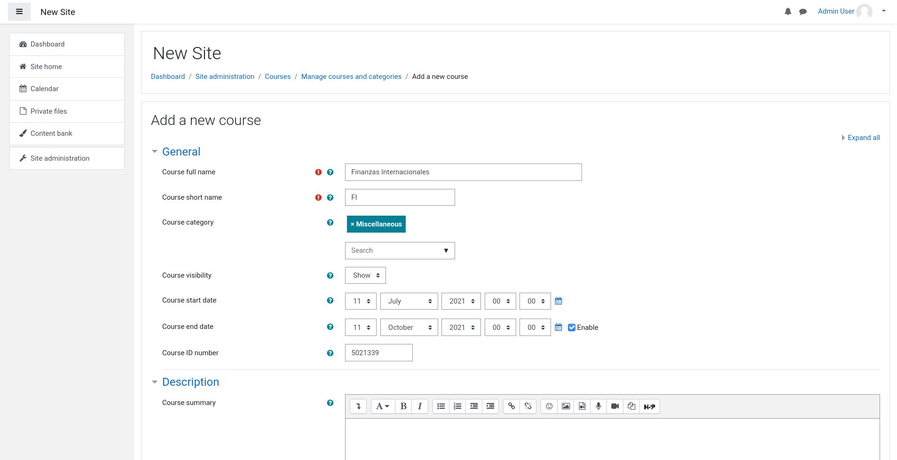

# Práctica 2: domesticación de aplicaciones y federación (propuesta LCMS)
## Inteligencia de Negocio
## Autora: Almudena García Jurado-Centurión

## Enunciado

### Introducción

Ante la creciente demanda de máster interuniversitarios virtuales, algunas universidades públicas andaluzas han propuesto la creación de la plataforma denominada campusvirtual. El objetivo de esta plataforma es que, en la medida de lo posible, se centralice la gestión y administración de dichos másters. Esto es, la matriculación se realiza en cada una de las universidades pero la docencia virtual se distribuye entre cada una de ellas.

La solución propuesta se basa en el uso de Moodle como gestor de contenidos y SimpleSAMLphp como software para desarrollar la parte de autentificación y provisión de usuarios. 

Cada universidad deberá desplegar su propio gestor de contenidos y su servicio de provisión de identidad. En el gestor de contenidos se albergará las asignaturas que la universidad coordina, se detalla en el apartado siguiente. El IdP tendrá que autentificar los usuarios de la propia universidad y delegar la autentificación de usuarios externos en los IdP del resto de universidades. 

### Caso de estudio

Este año, y como propuesta piloto, se ha seleccionado el Máster de Economía y Finanzas impartido por 4 universidades. El plan docente es el que se indica a continuación:

La primera columna de la tabla muestra el identificador que usaremos a lo largo del presente documento para referirnos a las asignaturas. La segunda columna indica el nombre de la asignatura mientras que la tercera contiene el acrónimo de la universidad encargada de impartir la docencia. Esta universidad será la responsable de proporcionar los recursos necesarios para el seguimiento virtual de la asignatura (una instancia de Moodle y un IdP capaz de autentificar a usuarios remotos).

De forma análoga a la impartición de la docencia, las gestión relacionada con la matriculación y desmatriculación de alumnos se hace en las secretarías de cada una de las universidades. Así, por ejemplo, los alumnos de la UHU se tendrán que dirigir a la secretaría de su centro para formalizar la matrícula en cualquiera de las asignaturas que conforman el plan de estudios, independientemente de si la asignatura es impartida por la UHU u otra universidad. Esta gestión local implica que cada universidad usa sus propios códigos para identificar las asignaturas:

### Atributos a intercambiar

A forma de resumen, los atributos que obligatoriamente deben intercambiar los IdP de cada una de las universidades:

- Personales: gn, cn, sn, schacSn1, displayName 
- Contacto/localizacion: irisMailMainAddress 
- Académicos/laborales: eduPersonScopedAffiliation, eduPersonAffiliation, eduPersonPrimaryAffiliation 
- Gestión: eduPersonPrincipalName, schacPersonalUniqueID,  schacUserStatu

En http://confia.aupa.info/media/docs/especificacion_atributos.pdf se puede consultar el detalle de todos y cada uno de estos atributos

### Pasos

Una vez que el alumno ha elegido dos universidades,  se le propone que siga los siguientes pasos para cada una de ellas:

1. Cree y configure una instancia de SimpleSAMLphp en modo IdP
2. Como fuente de autentificación se usará una de tipo sqlauth:SQL. Esto es, cada universidad realizará la autentificación y provisión del sus alumnos a partir de una base de datos sql. 
3. Instale un servidor mysql (se propone usar el contenedor oficial de mariadb https://hub.docker.com/_/mariadb)
4. Una vez instalado, importe el esquema de base de datos de la universidad elegida
5. Compruebe que la fuente de autentificación funciona correctamente
6. Cree y configure una instancia de SimpleSAMLphp en modo SP
7. Establezca la relación de confianza entre el SP y el IdP para que el SP pueda usar el IdP como fuente de autentificación
8. Instale moodle (https://hub.docker.com/r/jauer/moodle/) y cree las asignaturas de las que es responsable la universidad
9. Instale el módulo que permite la autentificación de usuarios usando SimpleSAML (https://moodle.org/plugins/auth_saml). Configúrelo adecuadamente y compruebe que pueden acceder los alumnos de la universidad que están matriculados en alguna de la asignaturas de la que la universidad es responsable. Además compruebe en el perfil de los alumnos de moodle que se  importan adecuadamente los atributos liberados por el IdP
10. Instale el módulo que permite la matriculación automática (https://moodle.org/plugins/view.php?plugin=enrol_saml) de alumos a partir de los datos contenidos en el atributo shacUserStatus devuelto por el IdP. Configúrelo adecuadamente para que la matriculación y desmatriculación de alumnos sea automática una ve que acceden a moodle

Una vez hecho todo esto, deberá conseguir que el IdP de una universidad dé la posibilidad de delegar la autentificación en el IdP de la otra universidad para autentificar a los usuarios de esta última.

## Resolución

### Instalación de SimpleSAML

Para instalar SimpleSAML, utilizaremos una imagen de Docker, que desplegaremos en un contenedor.
La imagen a utilizar será la unicon/simplesamlphp:latest (la última versión), y la desplegaremos con el comando:

	sudo docker run --name simplesamlphp -p 8081:80 -p 8444:443 -d unicon/simplesamlphp:latest

Esto creará un contenedor de nombre `simplesamlphp`, redireccionando varios de sus puertos al sistema anfitrión:

- http: Redireccionamos el puerto 80 del contenedor al 8081 del anfitrión (el puerto 8080 ya estaba reservado)
- https: Redireccionamos el puerto 443 al 8444 (el 8443 estaba reservado)

Una vez arrancado el contenedor, entramos en la dirección

https://localhost:8444/simplesaml

Comprobamos que ha arrancado correctamente

#### Configuración de SimpleSAML

Una vez comprobamos que la página carga correctamente, accedemos al contenedor para editar algunos ajustes. Editaremos los ajustes básicos, que luego empaquetaremos en forma de imagen base para crear las dos instancias

	sudo docker exec -it simplesamlphp bash

Esto nos abrirá una terminal dentro del contenedor

	[sudo] password for almu: 
	[root@6dfc2f5f3f1f /]# 

Para facilitar la edición de algunos ficheros, instalamos el editor `nano`

	yum install nano

Lo ejecutamos en el contenedor, y veremos algo así. Cuando nos pregunte "Is this ok", escribimos "y" y pulsamos Enter para instalar el paquete

	[root@6dfc2f5f3f1f /]# yum install nano
	Loaded plugins: fastestmirror, ovl
	Loading mirror speeds from cached hostfile
	epel/x86_64/metalink                                     |  34 kB     00:00     
	 * base: mirror.airenetworks.es
	 * epel: ftp.plusline.net
	 * extras: mirror.airenetworks.es
	 * remi-php72: mir01.syntis.net
	 * remi-safe: mir01.syntis.net
	 * updates: mirror.airenetworks.es
	base                                                     | 3.6 kB     00:00     
	epel                                                     | 4.7 kB     00:00     
	extras                                                   | 2.9 kB     00:00     
	remi-php72                                               | 3.0 kB     00:00     
	remi-safe                                                | 3.0 kB     00:00     
	updates                                                  | 2.9 kB     00:00     
	(1/9): base/7/x86_64/group_gz                              | 153 kB   00:00     
	(2/9): epel/x86_64/group_gz                                |  96 kB   00:00     
	(3/9): extras/7/x86_64/primary_db                          | 242 kB   00:00     
	(4/9): epel/x86_64/updateinfo                              | 1.0 MB   00:01     
	(5/9): remi-php72/primary_db                               | 250 kB   00:01     
	(6/9): remi-safe/primary_db                                | 2.0 MB   00:04     
	(7/9): base/7/x86_64/primary_db                            | 6.1 MB   00:05     
	(8/9): updates/7/x86_64/primary_db                         | 8.8 MB   00:11     
	(9/9): epel/x86_64/primary_db                              | 6.9 MB   00:18     
	Resolving Dependencies
	--> Running transaction check
	---> Package nano.x86_64 0:2.3.1-10.el7 will be installed
	--> Finished Dependency Resolution
	
	Dependencies Resolved
	
	================================================================================
	 Package        Arch             Version                   Repository      Size
	================================================================================
	Installing:
	 nano           x86_64           2.3.1-10.el7              base           440 k
	
	Transaction Summary
	================================================================================
	Install  1 Package
	
	Total download size: 440 k
	Installed size: 1.6 M
	Is this ok [y/d/N]: y
	Downloading packages:
	nano-2.3.1-10.el7.x86_64.rpm                               | 440 kB   00:00     
	Running transaction check
	Running transaction test
	Transaction test succeeded
	Running transaction
	  Installing : nano-2.3.1-10.el7.x86_64                                     1/1 
	  Verifying  : nano-2.3.1-10.el7.x86_64                                     1/1 
	
	Installed:
	  nano.x86_64 0:2.3.1-10.el7                                                    
	
	Complete!

##### Modificando la clave de administrador

Entramos al fichero `/var/simplesamlphp/config/config.php`

	nano /var/simplesamlphp/config/config.php

Y editamos el campo `auth.adminpassword`

	'auth.adminpassword' => 'admin'

Reemplazamos 'admin' por la clave de nuestra preferencia

##### Activando modo IDP

En el mismo fichero, activamos el modo IDP editando la variable `'enable.saml20-idp' `

	'enable.saml20-idp' => true,

##### Configurando modo SP

Preparamos algunas configuraciones para el SP. Entramos en `/var/simplesamlphp/config/authsources.php` y, en el bloque `default-sp`,  modificamos (o las creamos, en caso de no existir) estas líneas:

Preconfiguramos una URL para el `entityID`, y añadimos el certificado y la clave pública. Esto ayudará a modificar estos valores en las instancias del contenedor

	'entityID' => 'https://sp.edu.net/sp',
    //'privatekey' => 'server.key',
    //'certificate' => 'server.pub',
	'idp' => 'https://idp.edu.net/idp'

Dado que las claves deben ser únicas, estas no se generarán todavía. Deberán generarse al crear cada instancia.

##### Añadiendo fuente de autenticación

Entramos en el fichero `/var/simplesamlphp/config/authsources.php` y descomentamos el bloque `example-sql`. También editamos algunos campos para adaptarlos a MySQL

    'example-sql' => [
        'sqlauth:SQL',
        'dsn' => 'mysql:host=mariadb;port=3306;dbname=simplesaml',
        'username' => 'simplesaml',
        'password' => 'secretpassword',
        'query' => 'SELECT uid, givenName, email, eduPersonPrincipalName FROM users WHERE uid = :username ' .
            'AND password = SHA2(CONCAT((SELECT salt FROM users WHERE uid = :username), :password), 256);',
    ],

##### Configurando ruta de metadatos en el IDP

Entramos al fichero `/var/simplesamlphp/metadata/saml20-idp-hosted` y añadimos la información

$metadata['https://idp.edu.net/idp'] = array(
        'host' => '__DEFAULT__',
        'privatekey' => 'server.key',
        'certificate' => 'server.crt',
        'auth' => 'example-sql',
);

Esto servirá de base para las siguientes imágenes. Los certificados, dado que deben ser únicos, se generarán en cada instancia, por lo que no los crearemos ahora.

Como fuente de autenticación indicamos `example-sql`, correspondiente al ejemplo de uso de `sqlauth` 

##### Comprobando

Al entrar en la pestaña Federación de SimpleSAML vemos que tenemos los modos SP e IDP, y los metadatos del SP.

Comprobamos también que podemos iniciar sesión como administrador

#### Compilando la imagen

Una vez realizada la configuración básica, creamos una imagen con todas las configuraciones.
Nos copiamos el directorio `/var/simplesamlphp` en el directorio `simplesamlbase/simplesamlphp`, y nos creamos un Dockerfile con el siguiente contenido

	FROM unicon/simplesamlphp:latest 
	
	RUN rm -rf /var/simplesamlphp
	COPY ./simplesamlphp/ /var/simplesamlphp/

Hecho esto, compilamos la imagen y la subimos a Docker Hub

	sudo docker build . -t simplesamlbase
	sudo docker tag simplesamlbase almuhs/simplesamlphp_preconf:v1
	sudo docker push almuhs/simplesamlphp_preconf:v1

#### Creando las bases de datos

Tanto SimpleSAML como Moodle requieren de una base de datos para funcionar. Para ahorrar contenedores, utilizaremos el mismo contenedor para ambos.

Para crear la base de datos, nos basaremos en la imagen bitnami/mariadb. Sobre esta imagen, crearemos dos imágenes personalizadas, en las que cargaremos la base de datos de cada universidad. Mas adelante, cuando se despliegue el contenedor, se añadirán los datos de la base de datos de Moodle: una nueva base de datos y un nuevo usuario.

##### Creando las imágenes personalizadas

Para cargar los esquemas de cada universidad, crearemos un directorio sql/ en el mismo directorio del Dockerfile, donde alojaremos el script SQL correspondiente. Posteriormente, en el Dockerfile, añadiremos la siguiente línea para cargar el script en la imagen

	ADD sql/ /docker-entrypoint-initdb.d

Sobre esto, crearemos dos imágenes: `mariadb_upo`, con el esquema de bases de datos de la UPO; y `mariadb_uca`, con el esquema de bases de datos de la UCA.

En el caso de `mariadb_uca` también cambiaremos el puerto de MySQL al 3307. Esto permitirá arrancar ambos contenedores de bases de datos sobre la misma red, sin producir solapamiento.

El Dockerfile de `mariadb_upo` queda así:

	FROM bitnami/mariadb
	
	## Modify the ports used by MariaDB by default
	# It is also possible to change these environment variables at runtime
	# Copy the SQL script from /sql to Docker's entrypoint
	ADD sql/ /docker-entrypoint-initdb.d
	
	ENV MARIADB_PORT_NUMBER=3306
	EXPOSE 3306

El Docker de `mariadb_uca` queda así:

	FROM bitnami/mariadb
	
	## Modify the ports used by MariaDB by default
	# It is also possible to change these environment variables at runtime
	# Copy the SQL script from /sql to Docker's entrypoint
	ADD sql/ /docker-entrypoint-initdb.d
	
	ENV MARIADB_PORT_NUMBER=3307
	EXPOSE 3307

Además, en los scripts de la base de datos añadiremos las instrucciones para crear la nueva base de datos y el usuario asociados a las mismas.

##### Creando el script con el esquema de la base de datos

En el script donde se carga el esquema de la base de datos, añadimos varias instrucciones para crear la base de datos en sí y un nuevo usuario con total permiso sobre las mismas. Esto evitará el tener que crear la base de datos durante el despliegue, pudiendo utilizar el despliegue para crear una segunda base de datos, con los datos de moodle.

En `uca.sql`

	DROP DATABASE IF EXISTS uca;
	CREATE DATABASE uca;
	
	CREATE USER ucausr IDENTIFIED BY 'ucapass';
	GRANT ALL privileges ON uca.* to ucausr;

En `upo.sql`

	DROP DATABASE IF EXISTS upo;
	CREATE DATABASE upo;
	
	CREATE USER upousr IDENTIFIED BY 'upopass';
	GRANT ALL privileges ON upo.* to upousr;

##### Generando las imágenes personalizadas

Finalmente, generamos las imágenes personalizadas y las subimos a Docker Hub.

Para la UPO:

	cd upo/
	sudo docker build . -t mariadb_upo
	sudo docker tag mariadb_upo almuhs/mariadb_upo:v1
	sudo docker login
	sudo docker push almuhs/mariadb_upo:v1

Para la UCA:

	cd uca/
	sudo docker build . -t mariadb_uca
	sudo docker tag mariadb_uca almuhs/mariadb_uca:v1
	sudo docker login
	sudo docker push almuhs/mariadb_uca:v1

### Desplegando la infraestructura

Finalmente, desplegamos la infraestructura con todos los contenedores

#### Docker Compose

Nos creamos un fichero Docker Compose por cada universidad. Este fichero desplegará la siguiente infraestructura:

- Instancia de MariaDB, basada en la imagen personalizada de dicha universidad, en la que se creará una nueva base de datos y usuario para Moodle
- Instancia de Moodle, conectada a la instancia de MariaDB
	+ Con una conexión al volumen de datos de SimpleSAML
- Instancia de SimpleSAML
- Volumen de MariaDB
- 2 volúmenes para los datos de Moodle
- Volumen de SimpleSAML

Para los servicios web de SImpleSAML y Moodle, realizaremos un redireccionamiento de puertos, para evitar el solapamiento de los mismos:

- Moodle UPO:
	+ 8080 -> 8080
	+ 8443 -> 8443
- SimpleSAML UPO
	+ 8081 -> 80
	+ 8444 -> 443
- Moodle UCA
	+ 8082 -> 8080
	+ 8445 -> 8443
- SimpleSAML UCA
	+ 8083 -> 80
	+ 8446 -> 443

Además, el contenedor MariaDB de la UCA utilizará el puerto 3307 en lugar del 3306

#### Desplegando los contenedores

Para desplegar los contenedores, nos situamos en el directorio de cada universidad, y levantamos la infraestructura con docker-compose

	cd upo/
	sudo docker-compose up -d
	
	cd uca/
	sudo docker-compose up -d

Si todo ha ido bien, veremos algo como esto

	almu@debian:~/Practicas_IN/Practica2/uca$ sudo docker-compose up -d
	Creating network "uca_default" with the default driver
	Creating volume "uca_mariadb_data_uca" with local driver
	Creating volume "uca_moodle_data_uca" with local driver
	Creating volume "uca_moodledata_data_uca" with local driver
	Creating volume "uca_simplesamlphp_data_uca" with local driver
	Creating uca_mariadb_uca_1       ... done
	Creating uca_simplesamlphp_uca_1 ... done
	Creating uca_moodle_uca_1        ... done
	almu@debian:~/Practicas_IN/Practica2/uca$ cd ../upo
	almu@debian:~/Practicas_IN/Practica2/upo$ sudo docker-compose up -d
	Creating network "upo_default" with the default driver
	Creating volume "upo_mariadb_data_upo" with local driver
	Creating volume "upo_moodle_data_upo" with local driver
	Creating volume "upo_moodledata_data_upo" with local driver
	Creating volume "upo_simplesamlphp_data_upo" with local driver
	Creating upo_simplesamlphp_upo_1 ... done
	Creating upo_mariadb_upo_1       ... done
	Creating upo_moodle_upo_1        ... done
	almu@debian:~/Practicas_IN/Practica2/upo$ sudo docker ps
	CONTAINER ID   IMAGE                         COMMAND                  CREATED          STATUS          PORTS                                            NAMES
	c48a7aa12235   bitnami/moodle:3              "/opt/bitnami/script…"   4 seconds ago    Up 3 seconds    0.0.0.0:8080->8080/tcp, 0.0.0.0:8443->8443/tcp   upo_moodle_upo_1
	8d6d59df8197   unicon/simplesamlphp:latest   "httpd-foreground"       5 seconds ago    Up 3 seconds    0.0.0.0:8081->80/tcp, 0.0.0.0:8444->443/tcp      upo_simplesamlphp_upo_1
	68db04909b52   almuhs/mariadb_upo:v1         "/opt/bitnami/script…"   5 seconds ago    Up 4 seconds    3306/tcp                                         upo_mariadb_upo_1
	422b67be0148   bitnami/moodle:3              "/opt/bitnami/script…"   31 seconds ago   Up 30 seconds   0.0.0.0:8082->8080/tcp, 0.0.0.0:8445->8443/tcp   uca_moodle_uca_1
	fa6e241ed4af   almuhs/mariadb_uca:v1         "/opt/bitnami/script…"   32 seconds ago   Up 31 seconds   3306/tcp, 0.0.0.0:49155->3307/tcp                uca_mariadb_uca_1
	f1651014342e   unicon/simplesamlphp:latest   "httpd-foreground"       32 seconds ago   Up 31 seconds   0.0.0.0:8083->80/tcp, 0.0.0.0:8446->443/tcp      uca_simplesamlphp_uca_1
	almu@debian:~/Practicas_IN/Practica2/upo$ 

Los contenedores de Moodle tardarán varios minutos en desplegarse. Podemos ver el progreso del arranque con `docker logs`

	sudo docker logs upo_moodle_upo_1
	sudo docker logs uca_moodle_uca_1

Cuando termine el despliegue, veremos algo como esto

	almu@debian:~/Practicas_IN/Practica2/upo$ sudo docker logs uca_moodle_uca_1
	moodle 14:38:06.23 
	moodle 14:38:06.23 Welcome to the Bitnami moodle container
	moodle 14:38:06.23 Subscribe to project updates by watching https://github.com/bitnami/bitnami-docker-moodle
	moodle 14:38:06.23 Submit issues and feature requests at https://github.com/bitnami/bitnami-docker-moodle/issues
	moodle 14:38:06.23 
	moodle 14:38:06.23 INFO  ==> ** Starting Moodle setup **
	moodle 14:38:06.29 INFO  ==> Configuring PHP options
	moodle 14:38:06.31 INFO  ==> Validating settings in MYSQL_CLIENT_* env vars
	moodle 14:38:06.41 INFO  ==> Ensuring Moodle directories exist
	moodle 14:38:06.43 INFO  ==> Trying to connect to the database server
	moodle 14:38:21.48 INFO  ==> Running Moodle install script
	moodle 14:41:52.87 INFO  ==> Persisting Moodle installation
	moodle 14:41:58.29 INFO  ==> ** Moodle setup finished! **
	
	moodle 14:41:58.30 INFO  ==> ** Starting cron **
	moodle 14:41:58.33 INFO  ==> ** Starting Apache **
	[Fri Jul 09 14:41:58.400649 2021] [ssl:warn] [pid 1] AH01909: www.example.com:8443:0 server certificate does NOT include an ID which matches the server name
	[Fri Jul 09 14:41:58.401247 2021] [ssl:warn] [pid 1] AH01909: www.example.com:8443:0 server certificate does NOT include an ID which matches the server name
	[Fri Jul 09 14:41:58.448053 2021] [ssl:warn] [pid 1] AH01909: www.example.com:8443:0 server certificate does NOT include an ID which matches the server name
	[Fri Jul 09 14:41:58.448590 2021] [ssl:warn] [pid 1] AH01909: www.example.com:8443:0 server certificate does NOT include an ID which matches the server name
	[Fri Jul 09 14:41:58.466070 2021] [mpm_prefork:notice] [pid 1] AH00163: Apache/2.4.48 (Unix) OpenSSL/1.1.1d PHP/7.3.29 configured -- resuming normal operations
	[Fri Jul 09 14:41:58.466110 2021] [core:notice] [pid 1] AH00094: Command line: '/opt/bitnami/apache/bin/httpd -f /opt/bitnami/apache/conf/httpd.conf -D FOREGROUND'
	
	almu@debian:~/Practicas_IN/Practica2/upo$ sudo docker logs upo_moodle_upo_1
	moodle 14:38:33.66 
	moodle 14:38:33.66 Welcome to the Bitnami moodle container
	moodle 14:38:33.66 Subscribe to project updates by watching https://github.com/bitnami/bitnami-docker-moodle
	moodle 14:38:33.66 Submit issues and feature requests at https://github.com/bitnami/bitnami-docker-moodle/issues
	moodle 14:38:33.66 
	moodle 14:38:33.66 INFO  ==> ** Starting Moodle setup **
	moodle 14:38:33.73 INFO  ==> Configuring PHP options
	moodle 14:38:33.75 INFO  ==> Validating settings in MYSQL_CLIENT_* env vars
	moodle 14:38:33.85 INFO  ==> Ensuring Moodle directories exist
	moodle 14:38:33.87 INFO  ==> Trying to connect to the database server
	moodle 14:38:48.91 INFO  ==> Running Moodle install script
	moodle 14:42:19.75 INFO  ==> Persisting Moodle installation
	moodle 14:42:25.09 INFO  ==> ** Moodle setup finished! **
	
	moodle 14:42:25.10 INFO  ==> ** Starting cron **
	moodle 14:42:25.12 INFO  ==> ** Starting Apache **
	[Fri Jul 09 14:42:25.175024 2021] [ssl:warn] [pid 1] AH01909: www.example.com:8443:0 server certificate does NOT include an ID which matches the server name
	[Fri Jul 09 14:42:25.175465 2021] [ssl:warn] [pid 1] AH01909: www.example.com:8443:0 server certificate does NOT include an ID which matches the server name
	[Fri Jul 09 14:42:25.207388 2021] [ssl:warn] [pid 1] AH01909: www.example.com:8443:0 server certificate does NOT include an ID which matches the server name
	[Fri Jul 09 14:42:25.207840 2021] [ssl:warn] [pid 1] AH01909: www.example.com:8443:0 server certificate does NOT include an ID which matches the server name
	[Fri Jul 09 14:42:25.225081 2021] [mpm_prefork:notice] [pid 1] AH00163: Apache/2.4.48 (Unix) OpenSSL/1.1.1d PHP/7.3.29 configured -- resuming normal operations
	[Fri Jul 09 14:42:25.225114 2021] [core:notice] [pid 1] AH00094: Command line: '/opt/bitnami/apache/bin/httpd -f /opt/bitnami/apache/conf/httpd.conf -D FOREGROUND'

#### Probando la infraestructura

Para probar la infraestructura, entramos a las URL de los diferentes servicios web

- Moodle UPO: 
	- http://localhost:8080/
	- https://localhost:8443/
- SimpleSAML UPO
	+ http://localhost:8081/simplesaml
	+ https://localhost:8444/simplesaml
- Moodle UCA
	+ http://localhost:8082/
	+ https://localhost:8445/
- SimpleSAML UCA
	+ http://localhost:8083/simplesaml/
	+ https://localhost:8446/simplesaml/
	
### Configurando las instancias de SimpleSAML

Con la infraestructura básica preparada, pasamos a configurar las instancias de SimpleSAML. 

#### SimpleSAML UPO

##### Fuentes de autenticación

Entramos en el fichero `/var/simplesamlphp/config/authsources.php` y editamos las fuentes `default-sp` y `example-sql`.

	'default-sp' => [
	        'saml:SP',
	
	        // The entity ID of this SP.
	        // Can be NULL/unset, in which case an entity ID is generated based on the metadata URL.
	        'entityID' => null,
	        'privatekey' => 'server.key',
	        'certificate' => 'server.pub',
	        // The entity ID of the IdP this SP should contact.
	        // Can be NULL/unset, in which case the user will be shown a list of available IdPs.
	        'idp' => 'https://idp.upo.net/idp',
	        
	        ...

En example-sql, añadimos los datos de conexión de la base de datos, y la consulta a la misma

	'example-sql' => [
	        'sqlauth:SQL',
	        'dsn' => 'mysql:host=mariadb_upo;port=3306;dbname=upo',
	        'username' => 'upousr',
	        'password' => 'upopass',
	        'query' => 'SELECT nombre As gn,
	                        CONCAT(nombre," ",ape1, " ",ape2) As cn,
	                        CONCAT(ape1, " ", ape2) As sn,
	                        ape1 As schacSn1,
	                        identificador As displayName,
	                        correo As irisMailMainAddress,
	                        "student@upo.es" as eduPersonScopedAffiliation,
	                        "student" As  eduPersonAffiliation,
	                        "student" As eduPersonPrimaryAffiliation,
	                        CONCAT(:username,"@upo.es") As eduPersonPrincipalName, 
	                        CONCAT("urn:mace:upo.es:schac:personalUniqueID:es:NIF:",dni) As schacPersonalUniqueID,
	                        CONCAT("urn:mace:terena.org:schac:userStatus:es:upo.es:", asignaturas.cod, ":2021-22:student:active") as schacUserStatus
	                        FROM upo.alumnos, upo.asignaturas, upo.matriculados
	                        WHERE matriculados.id_alumno = alumnos.id
	                              AND alumnos.identificador=:username
	                              AND password=:password',
	    ],

##### Certificados del SP

Creamos los certificados para `default-sp`. Para ello, utilizamos la [herramienta de creación de certificados de SAMLTool](https://www.samltool.com/self_signed_certs.php)

Rellenamos los datos

Y pulsamos en "Generate self-signed certs"

.png)

Copiamos el contenido de private-key en `/var/simplesamlphp/cert/server.key`, y el de X.509 cert en `/var/simplesamlphp/cert/server.pub`.

##### Par de claves del IDP

Generamos el par de claves del IDP

	cd /var/simplesamlphp/cert
	openssl req -x509 -nodes -days 365 -newkey rsa:2048 -keyout /etc/pki/tls/private/server.key -out /etc/pki/tls/certs/server.crt

##### Metadatos del IDP

Corregimos el nombre de dominio en los metadatos del IDP

	nano /var/simplesamlphp/metadata/saml20-idp-hosted.php

Y editamos los metadatos de esta manera:

	$metadata['https://idp.upo.net/idp'] = array(
	        'host' => '__DEFAULT__',
	        'privatekey' => 'server.key',
	        'certificate' => 'server.pub',
	        'auth' => 'example-sql',
	);

Comprobamos que los metadatos se han generado correctamente

##### Probando el IDP

En la interfaz web de SimpleSAML pulsamos en "Probar las fuentes para la autentificación ya configuradas"

Vemos que aparece el "example-sql" en la lista

Al pulsar sobre él, vemos una pantalla de login

##### Probando el inicio de sesión

Probamos el inicio de sesión. Entramos en `example-sql` desde la interfaz de SimpleSAML, e introducimos un nombre de usuario y una contraseña

.png)

En este caso, puesto que no tenemos ningún usuario registrado, nos dará un error

#### SimpleSAML UCA

Repetimos el proceso en la instancia de la otra universidad

##### Fuentes de autenticación

Entramos en el fichero `/var/simplesamlphp/config/authsources.php` y editamos las fuentes `default-sp` y `example-sql`.

	'default-sp' => [
	        'saml:SP',
	
	        // The entity ID of this SP.
	        // Can be NULL/unset, in which case an entity ID is generated based on the metadata URL.
	        'entityID' => null,
	        'privatekey' => 'server.key',
	        'certificate' => 'server.pub',
	        // The entity ID of the IdP this SP should contact.
	        // Can be NULL/unset, in which case the user will be shown a list of available IdPs.
	        'idp' => 'https://idp.uca.net/idp',
	        
	        ...

En example-sql, añadimos los datos de conexión de la base de datos, y la consulta a la misma

	'example-sql' => [
	        'sqlauth:SQL',
	        'dsn' => 'mysql:host=mariadb_uca;port=3307;dbname=uca',
	        'username' => 'ucausr',
	        'password' => 'ucapass',
	        'query' => 'SELECT nombre As gn,
	                        CONCAT(nombre," ",apellidos) As cn,
	                        apellidos As sn,
	                        apellidos As schacSn1,
	                        alumnos.cod As displayName,
	                        correo As irisMailMainAddress,
	                        "student@uca.es" as eduPersonScopedAffiliation,
	                        "student" As  eduPersonAffiliation,
	                        "student" As eduPersonPrimaryAffiliation,
	                        CONCAT(:username, "@uca.es") As eduPersonPrincipalName,
	                        CONCAT("urn:mace:upo.es:schac:personalUniqueID:es:NIF:",CONCAT(dni, letra) ) As schacPersonalUniqueID,
	                        CONCAT("urn:mace:terena.org:schac:userStatus:es:uca.es:", asignaturas.cod, ":2021-22:student:active") as schacUserStatus
	                        FROM uca.alumnos, uca.asignaturas, uca.matriculados
	                        WHERE matriculados.id_alumno = alumnos.id
	                              AND alumnos.cod=:username
	                              AND password=:password',
	    ],

##### Certificados del SP

##### Metadatos del IDP

Corregimos el nombre de dominio en los metadatos del IDP

	nano /var/simplesamlphp/metadata/saml20-idp-hosted.php

Y editamos los metadatos de esta manera:

	$metadata['https://idp.uca.net/idp'] = array(
	        'host' => '__DEFAULT__',
	        'privatekey' => 'server.key',
	        'certificate' => 'server.pub',
	        'auth' => 'example-sql',
	);

Comprobamos que los metadatos se han generado correctamente

#### Probando el inicio de sesión

##### Añadiendo usuarios a la base de datos

Añadimos varios usuarios a la base de datos. Nos conectamos a la base de datos con el comando

	sudo docker exec -it uca_mariadb_uca_1 mysql -u 'ucausr' -p

E insertamos los usuarios

	use uca;
	INSERT INTO uca.alumnos(cod, nombre, apellidos, password, dni, letra, correo)
        VALUES('juan.perez', 'Juan', 'Perez Martin', 'user1', '56128914', 'K', 'juan.perez@uca.es');

	INSERT INTO uca.alumnos(cod, nombre, apellidos, password, dni, letra, correo)
        VALUES('alvaro.gomez', 'Alvaro', 'Gomez Martin', 'user2' , '23081274', 'L', 'alvaro.gomez@u.es');
        
	INSERT INTO uca.matriculados(id_alumno, status) VALUES (1, 'a');
	INSERT INTO uca.matriculados(id_alumno, status) VALUES (2, 'a');
	
##### Autenticando usuarios

En la interfaz de SimpleSAML, entramos en "example-sql", e introducimos los datos de nuestro usuario

_newuser.png)

Vemos que el usuario es autenticado correctamente

### Uniendo el SP al IDP (y viceversa)

Para unir cada SP con su ISP, hemos de compartir los metadatos entre ambas caras.
En la interfaz de SimpleSAMLPHP accedemos a la pestaña de Federación para obtener los metadatos de ambos.

En esta veremos los metadatos de ambos. Para establecer la relación de confianza, debemos compartir los metadatos entre ellos.

#### Compartiendo metadatos del IDP al SP

En la pestaña Federación, en Metadatos IdP SAML 2.0, pulsamos sobre "Ver metadatos."

Copiamos los metadatos del bloque de abajo, en formato PHP, y los pegamos en el fichero `metadata/saml20-idp-remote.php`

#### Compartiendo metadatos del SP al IDP

Repetimos el proceso, pero esta vez en sentido inverso. En la pestaña Federación, en Metadatos SP SAML 2.0, pulsamos sobre "Ver metadatos"

.png)

Copiamos los metadatos en formato PHP en el fichero `metadata/saml20-sp-remote.php`

#### Comprobando el acceso

En la pestaña Autenticación, pulsamos en "Probar las fuentes para la autentificación ya configuradas", y luego seleccionamos "default-sp"

.png)

Vemos que el SP ya es capaz de detectar correctamente al IDP. Repetimos el proceso con la otra universidad

### Comunicando ambas universidades

#### Compartiendo metadatos

Repetimos el proceso que hicimos en el paso anterior, compartiendo los metadatos de los SP e IDP entre las universidades.

Los Metadatos SP SAML 2.0 los copiamos en el fichero `metadata/saml20-sp-remote.php` de la otra universidad. Los Metadatos IDP SAML 2.0 los copiamos en el fichero `metadata/saml20-idp-remote.php` de la otra universidad. 

#### Comprobando el acceso

Esta vez, cuando pulsamos en "default-sp", se nos ofrecen los IDP de ambas universidades. Si seleccionamos el IDP de la otra universidad, SimpleSAML nos redirigirá a su plataforma.

### Configurando Moodle

Arrancamos Moodle e iniciamos sesión

#### Creando las asignaturas

Con Moodle ya preparado, pasamos a crear las asignaturas en la instancia de cada universidad.

 | \# |	Nombre |	Universidad Responsable |
 | -- | -- | -- |
| 1 |	Programación I	| UHU
2 |	SISTEMAS DE ALMACENAMIENTO DE LA INFORMACIÓN |	UHU
3 | 	FUNDAMENTOS DE MATEMÁTICAS |	UHU
4 | MODELOS PREDICTIVOS I |	US
5 |	MINERÍA DE DATOS I | 	US
6 |	TÉCNICAS DE OPTIMIZACIÓN	|	US
7 |	MODELOS PREDICTIVOS II |	UPO
8 	| MINERÍA DE DATOS II | UPO
9  | INSTRUMENTOS Y DERIVADOS |	UPO
10 |	FINANZAS INTERNACIONALES | 	UCA
11 |	GESTIÓN DEL RIESGO Y ASEGURAMIENTO |	UCA
12 |	FINANZAS COMPUTATIVAS |	UCA

En nuestro caso, puesto que solo implementamos para la UPO y la UCA, las asignaturas que nos corresponden son:

| \# |	Nombre |	Universidad Responsable |
 | -- | -- | -- |
7 |	MODELOS PREDICTIVOS II |	UPO
8 	| MINERÍA DE DATOS II | UPO
9  | INSTRUMENTOS Y DERIVADOS |	UPO
10 |	FINANZAS INTERNACIONALES | 	UCA
11 |	GESTIÓN DEL RIESGO Y ASEGURAMIENTO |	UCA
12 |	FINANZAS COMPUTATIVAS |	UCA

Estas asignaturas se corresponden con los siguientes códigos

\# 	|	     UPO      |	     UCA 
-- |   -- | -- | 
7 	|	5021336  |	5021336
8 |	5021337 |	5021337
 9 |	5021338 |	5021338 
 10 |	5021339  |	5021339
 11 |	5021340 |	5021340
 12 | 5021341 | 	5021341

##### Asignaturas de la UPO

Empezamos creando las asignaturas de la UPO, en la instancia Moodle de dicha universidad (http://localhost:8080)

Accedemos a Site administration y, allí, abrimos la pestaña "Courses" y pulsamos "Add a new course"

Creamos la primera asignatura: Modelos Predictivos II. En el Course ID Number, introducimos el código de la asignatura para la UPO

Comprobamos que la asignatura se ha creado correctamente

Pasamos a crear el resto de asignaturas

.png)

.png)

##### Asignaturas de la UCA

Seguimos con las asignaturas de la UCA, en http://localhost:8082

_uca.png)

_uca.png)

#### Instalando auth_saml

Creadas las asignaturas, pasamos a instalar el módulo [auth_saml](https://moodle.org/plugins/auth_saml). Este nos permitirá realizar la autenticación de usuarios de Moodle a través de SimpleSAML.

Lo descargamos de la [página de descargas](https://moodle.org/plugins/auth_saml/versions) de la web oficial. En este caso, descargamos la última versión (auth/saml version of 16-07-2019 (2019071601)).

Hecho esto, entramos a Moodle, en Site administration y, en la pestaña plugins, pulsamos "add a new plugin"

Arrastramos el fichero ZIP a la sección ZIP Package, y pulsamos en "Install plugin from the ZIP file"

.png)

En la nueva página, pulsamos en "Continue"

Nos aparecerá una página indicando que cumple los requisitos. Pulsamos el botón de la parte inferior

Comenzará la instalación del plugin. Pulsamos en "Upgrade Moodle database now"

.png)

Nos aparecerá un mensaje indicando que la instalación ha sido exitosa

Vemos un formulario donde se nos indican los datos de configuración del plugin. Los modificamos acorde a nuestra instalación, y pulsamos el botón al final de la página

.png)

Volveremos a la página principal de Moodle

##### Activando el módulo

Volvemos a Site Administration y, en la pestaña plugins, navegamos hasta la sección "Administration", y pulsamos sobre ella

Nos llevará a una página con el listado de plugins de autenticación. Buscamos "SAML Authentication", y pulsamos en el botón del "ojo" en la misma

Vemos como el módulo se activa correctamente

Pulsamos en "Save changes" al final de la página

Repetimos el proceso con la otra universidad

#### Instalando enrol_saml

Repetimos el proceso anterior con el plugin enrol_saml. Descargamos el plugin de la [pagina oficial](https://moodle.org/plugins/enrol_saml/versions), y lo cargamos en Moodle

7.png)

5.png)

Esta vez, para activarlo, en la pestaña de Plugins, navegamos a la sección Enrolments

Y lo activamos de forma similar a la anterior

Repetimos el proceso en la otra universidad

#### Registrando alumnos

Con los plugins de SAML ya creados, pasamos a registrar algunos alumnos utilizando SAML como autenticación.

##### Registrando usuarios en la base de datos

Para poder sincronizar los alumnos con SImpleSAML, es necesario que estos estén ya registrados en la base de datos de la universidad.

Para ello, accedemos a dicha base de datos, y los añadimos. En la UCA ya lo añadimos anteriormente, así que repetiremos el proceso con la UPO

	almu@debian:~/Practicas_IN/Practica2/uca$ sudo docker exec -it upo_mariadb_upo_1 mysql -u 'upousr' -p
	[sudo] password for almu: 
	Enter password: 
	Welcome to the MariaDB monitor.  Commands end with ; or \g.
	Your MariaDB connection id is 183
	Server version: 10.5.11-MariaDB Source distribution
	
	Copyright (c) 2000, 2018, Oracle, MariaDB Corporation Ab and others.
	
	Type 'help;' or '\h' for help. Type '\c' to clear the current input statement.
	
	MariaDB [(none)]> use upo;
	Reading table information for completion of table and column names
	You can turn off this feature to get a quicker startup with -A
	
	Database changed
	MariaDB [upo]> INSERT INTO upo.alumnos(identificador, nombre, ape1, ape2, password, dni, correo)
	    ->         VALUES('sara.marquez', 'Sara', 'Marquez', 'Lopez', 'user3', '12563108J', 'sara.marquez@upo.es');
	Query OK, 1 row affected (0.006 sec)
	
	MariaDB [upo]> INSERT INTO upo.alumnos(identificador, nombre, ape1, ape2, password, dni, correo)
	    ->         VALUES('marta.santos', 'Marta', 'Santos', 'Garcia', 'user4', '10437984H', 'marta.santos@upo.es');
	Query OK, 1 row affected (0.005 sec)
	
	MariaDB [upo]> INSERT INTO upo.matriculados(id_alumno, status) VALUES (1, 'a');
	ERROR 1054 (42S22): Unknown column 'status' in 'field list'
	MariaDB [upo]> INSERT INTO upo.matriculados(id_alumno, enabled) VALUES (1, 1);
	Query OK, 1 row affected (0.007 sec)
	
	MariaDB [upo]> INSERT INTO upo.matriculados(id_alumno, enabled) VALUES (2, 1);
	Query OK, 1 row affected (0.006 sec)
	
	MariaDB [upo]> INSERT INTO upo.asignaturas(acod, cod) VALUES('5021336', '5021336');
	Query OK, 1 row affected (0.005 sec)
	
	MariaDB [upo]> INSERT INTO upo.asignaturas(acod, cod) VALUES('5021337', '5021337');
	Query OK, 1 row affected (0.005 sec)
	
	MariaDB [upo]> INSERT INTO upo.asignaturas(acod, cod) VALUES('5021338', '5021338');
	Query OK, 1 row affected (0.005 sec)

##### Registrando los usuarios en Moodle

Añadidos los usuarios a la base de datos, los registramos en Moodle. 

En Site Administration, en la pestaña Users, pulsamos "Add a new user"

Rellenamos los datos del usuario, indicando en "Choose an authentication method" SAML Authentication

#### Matriculando a los usuarios en asignaturas

Por cada asignatura, pulsamos en "Participants" y añadimos a los usuarios que hemos registrado

Repetimos el proceso en la otra universidad

### Generando imágenes de la infraestructura

Generamos imágenes con el estado de la infraestructura hasta el momento:

- Base de datos UPO: [almuhs/mariadb_upo:v2](https://hub.docker.com/repository/docker/almuhs/mariadb_upo)
- Base de datos UCA: [almuhs/mariadb_uca:v2](https://hub.docker.com/repository/docker/almuhs/mariadb_uca)
- SimpleSAML UPO: [almuhs/simplesamlphp_upo:v1](https://hub.docker.com/repository/docker/almuhs/simplesamlphp_upo)
- SimpleSAML UCA: [almuhs/simplesamlphp_uca:v1](https://hub.docker.com/repository/docker/almuhs/simplesamlphp_uca)

- Imagen mixta SimpleSAML+Moodle UPO: [almuhs/simplesamlphp_moodle_upo](https://hub.docker.com/repository/docker/almuhs/simplesamlphp_moodle_upo)
	+ Clave Admin: adminMoodle123+

Actualizamos los ficheros Docker Compose para generar los contenedores desde estas imágenes

